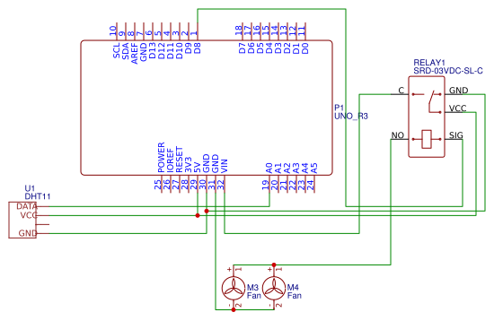

# Temperatuurgevoelige Ventilator
> Blijf koel deze zomer dankzij een temperatuurgevoelige ventilator. Gemaakt met behulp van een Arduino.

### Bouwinstructies
De bouwinstructies voor dit project, inclusief een uitgebreid filmpje en een BOM (Bill Of Materials) zijn te vinden op [mijn site](https://www.stachredeker.nl/71-blijf-koel-deze-zomer-temperatuurgevoelige-ventilator).

